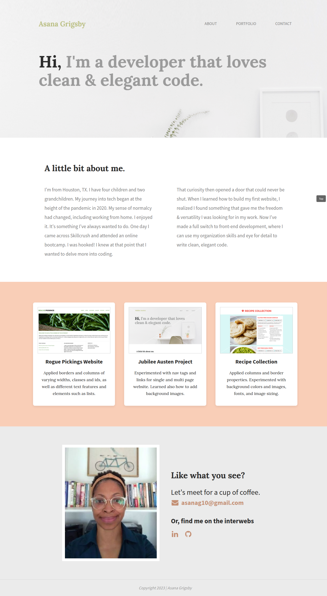
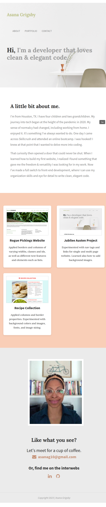
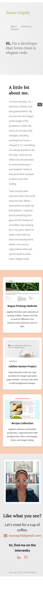

# Milestone Project — Front-End Portfolio

A personal front-end learning portfolio built as a coding bootcamp milestone project. It showcases a few of my early projects, a short bio, and contact details, and was used to practice building a responsive, semantic, accessible single-page site with HTML and CSS.

## Features

- Responsive single-page layout (desktop, tablet, and mobile breakpoints)
- Semantic HTML5 structure (`header`, `nav`, `main`, `section`, `footer`)
- Hero section with a fixed background and custom Google Fonts
- Portfolio grid built with CSS Grid for evenly aligned project cards
- Two-column contact section built with Flexbox
- Accessibility touches: descriptive `alt` text, `aria-label`s on links, and safe `rel="noopener noreferrer"` external links
- Fixed "back to top" link

## Tools Used

- HTML5
- CSS3
- Flexbox & CSS Grid
- Normalize.css
- Google Fonts (Lora, Source Sans Pro)
- Git / GitHub
- Browser DevTools

## Getting Started

1. Clone the repo:
   ```bash
   git clone https://github.com/Asanag10/Milestone-Project.git
   ```
2. Open `index.html` in your browser.

## What I Learned

- Replacing brittle float-based layouts with modern Flexbox and CSS Grid
- Building responsive layouts with media queries and flexible (`min-height`, `max-width`, `%`/`fr`) sizing instead of fixed pixel dimensions
- Writing valid, semantic HTML (correct `<head>` ordering, no duplicate attributes, no invalid nested interactive elements)
- Improving accessibility with meaningful `alt` text, `aria-label`s, and `rel="noopener noreferrer"` on links that open in a new tab
- Organizing and de-duplicating CSS for a cleaner, more maintainable stylesheet
- Using browser DevTools to debug layout and verify responsive behavior across breakpoints

## Screenshots

Screenshots live in the `screenshots/` directory and are also the shots used for my Contra and Dribbble profiles.

| Viewport | File | Capture width |
| --- | --- | --- |
| Desktop | `screenshots/desktop.png` | 1440px |
| Tablet | `screenshots/tablet.png` | 768px |
| Mobile | `screenshots/mobile.png` | 375px |





To re-capture: open `index.html` in your browser, open DevTools' device toolbar, set the viewport width to the value above, and take a full-page screenshot.

## Author

[Asanag10](https://github.com/Asanag10)
